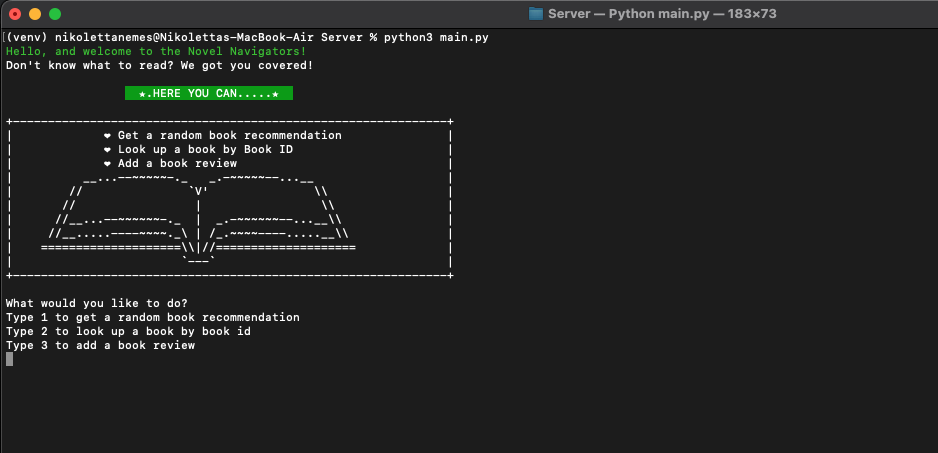
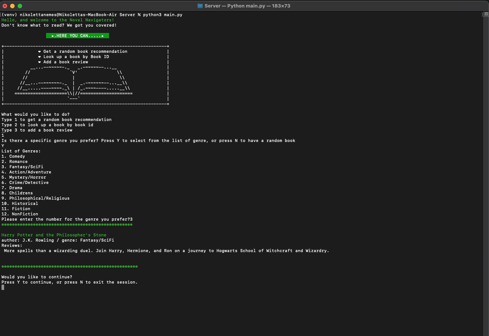

# Novel Navigators: From Algorithms to Authors, We Find Your Next Read 📚

## About
A Flask-based book recommendation API that suggests reads to users based on inputs like genre, or even provides random recommendations. Now featuring enhanced endpoints for fetching book details and adding reviews.

### The Coding Team
- [Cecilia Chang](https://github.com/cecechang)
- [Kayley Donnelly](https://github.com/kayley31)
- [Annie Wilson](https://github.com/anniewils97)
- [Tara Patterson](https://github.com/Tara2805)
- [Nikoletta Nemes](https://github.com/NicoleNemes)

## Our Favourite Reads
**Team's Fave Reads**
- Annie's current favourite read is "The Raybearer" by Jordan Ifueko.
- Cecilia's current favourite read is "The Phoenix Project" by Gene Kim, George Spafford, and Kevin Behr.
- Tara's current favourite read is "Dune" by Frank Herbert.
- Nikki's current favourite read is the "ACOTAR" series by Sarah J. Maas.
- Kayley's current favourite read is "Invisible Child" by Andrea Elliott.

### Technical Requirements
- MySQL
- MySQL Workbench
- Python 3
- Flask

### Installation
1. Clone this repository to your local machine.
2. Install Python 3 if not already installed.
3. Install Flask by running `pip install flask`.
4. Install MySQL and set up a database named `Novel_Navigators`.
5. Execute the provided SQL script to create tables and insert data.
6. Configure `config.py` with your MySQL database credentials.

### How to Run
1. Ensure the virtual environment is activated by running `source venv/bin/activate` (on Mac) or `venv\Scripts\activate` (on Windows) in your terminal.
2. Navigate to the project directory and run the `db_utils.py`, then `app.py`, to define the functions and start the server.
3. After this, you can run the `main.py` file. Once you run the main.py file your app will begin, and you will be able to use our API.

4. You can also access the API endpoints locally at `http://127.0.0.1:5000/`.

### API Endpoints
- `/genres` (GET): Get all genres.
- `/random_book` (GET): Get a random book info.
- `/genres/<int:genre_id>/books` (GET): Get books by genre.
- `/book/<int:book_id>` (GET): Get book by book ID.
- `/book/add_review` (POST): Add a review for a specific book.

## Example Usage
- Get all genres:

GET http://127.0.0.1:5000/genres

- Get a random book:

GET http://127.0.0.1:5000/random_book

- Get books by genre ID:

GET http://127.0.0.1:5000/genres/1/books

- Get a specific book by book ID:

GET http://127.0.0.1:5000/book/1

- Add a review for a specific book:

POST http://127.0.0.1:5000/book/add_review

Body: {"book_id": 1, "review_message": "A wonderful read!"}
